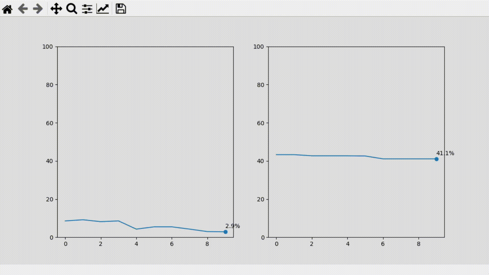
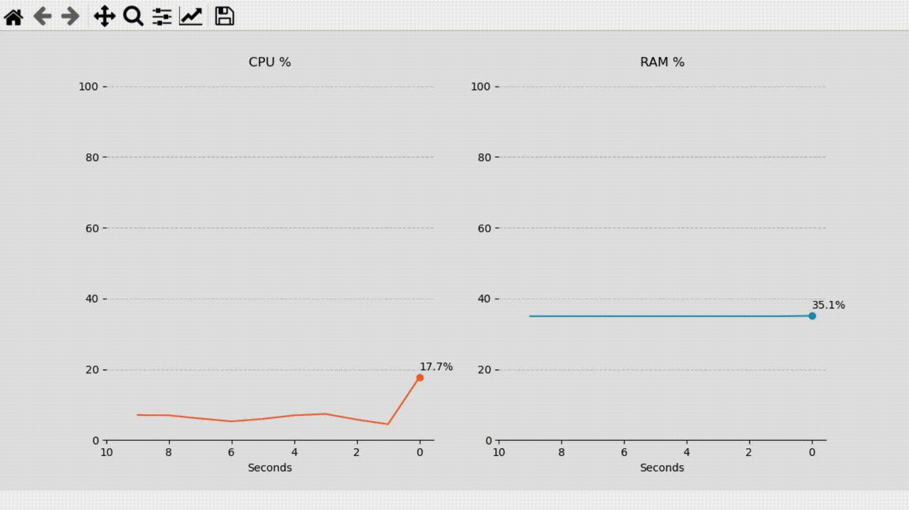
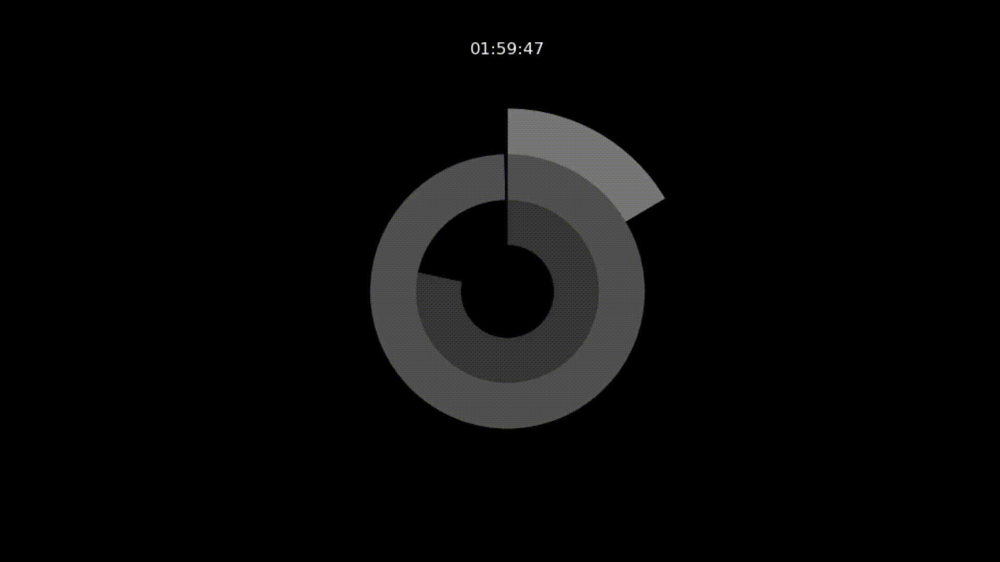

# Matplotlib-real-time-viz
Examples of real-time data visualization with Matplotlib's FuncAnimation

Code from the article:  

## Scripts
CPU_v1.py - Draw two simple charts with CPU and memory information:  
  
CPU_final - Same as before, but with more details:  
  
Map - Plots a map with data from an Excel file:  
  
Clock - Plot a donut chart clock:
